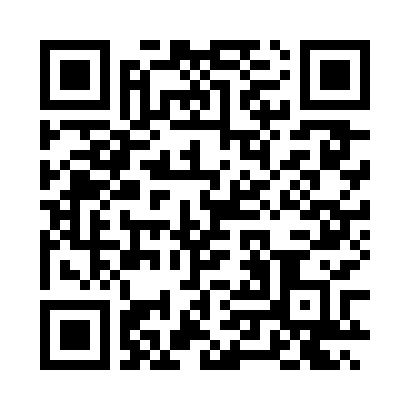

# 🥦 VeggieTales Project

## 👥 Authors

- **Leonardo Kildani** – leonardo.kildani@sjsu.edu
- **Dylan Matthews** – dylan.matthews@sjsu.edu
- **Jorge Zavala** – jorge.zavala@sjsu.edu

---

## 📖 Project Overview

**VeggieTales** is a transparent and interactive system that enables consumers to trace the full journey of their produce — from farm to store.

Each product batch is assigned a unique, scannable QR code. When scanned, the system retrieves and processes batch data, transforming it into a human-readable story using a large language model (LLM). In addition, the LLM calculates and assigns a **sustainability score**, offering users meaningful insight into the environmental impact of their food choices.

Key features:

- Batch-based product tracking
- Farm-to-store lifecycle visibility
- QR code integration
- AI-generated storytelling and sustainability scoring

---

## 🛠 Tech Stack

- **Flask** – Lightweight Python web framework for API/backend development
- **MongoDB Atlas** – Cloud database for storing batch data
- **Gemini LLM** – Analyzes batch data to generate readable stories and calculate sustainability scores
- **AWS EC2 + Nginx** – Hosting and deployment of the Flask application

### Batch Data Schema in MongoDB Atlas

```json
batch {
	batch_id:number,
	produce: string,
	farm: {
		farm_name: string,
		location: string,
		plant_date: date,
		harvest_date: date,
		climate_celcius: number,
		water_consumption_gallons: number,
		carbon_emissions_metric_tons: number,
		pesticides: list(string),
		soil_type: string,
		farm_certifications: list(string)
	},
	delivery: {
		delivery_company_name: string,
		delivery_duration: time,
		delivery_distance: number,
		transport_temp: number
	},
	store: {
		store_name: string,
		location: string,
		shelf_temp: number,
		date_shelved: date,
	}
}
```

---

## 📁 Project Structure

```
VeggieTales/
│
├── app/
│ ├── app.py # Main Flask app: defines routes, runs server
│ ├── database/ # MongoDB connectivity and API logic
│ ├── service/ # LLM API integration
│ ├── static/ # Static assets (CSS, JS, images)
│ └── templates/ # HTML templates (Flask Jinja2)
│
├── qr_codes/ # QR code generation scripts and output
│
└── LICENSE # MIT License
```

---

## 🧪 Example QR Code



---

## 📄 License

This project is licensed under the **MIT License**. See the [LICENSE](./LICENSE) file for more details.
